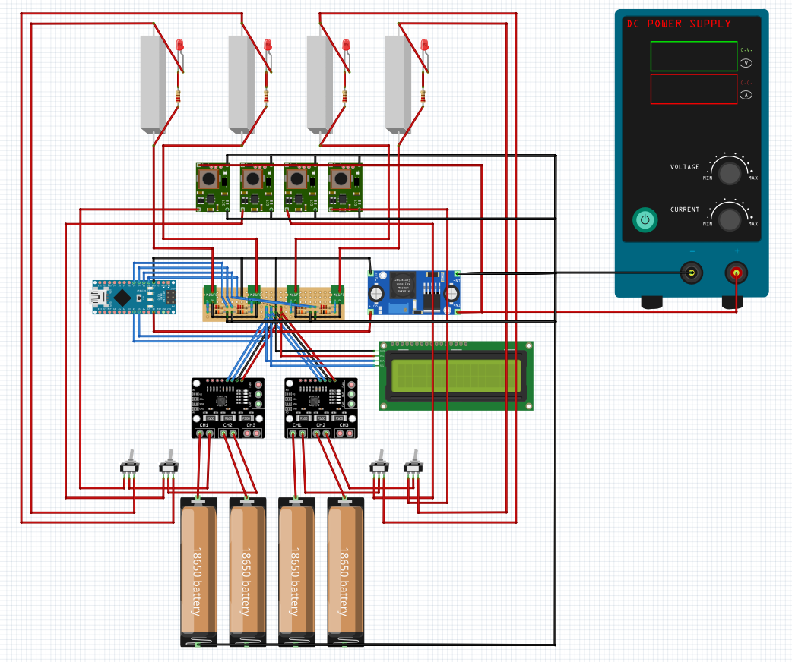
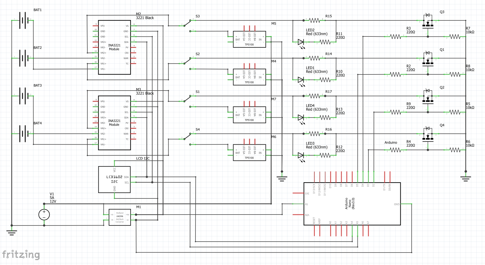

# Li-ion Battery Charger & Tester

Arduino-based N-channel charger and discharge tester for 18650/21700 (or any other type) Li-ion batteries.

The project uses INA3221 current/voltage monitors to track each channel and measures:

* Charging time
* Discharge capacity (mAh)
* Internal resistance (mΩ)
* Battery voltage and current

A 16×2 LCD displays the current channel status and measurements. Each channel is controlled independently via a MOSFET-based discharge load.

Max charge current: 1A (depends on TP5100 module).

Max discharge current: ~1.6A (depends on load resistance).

It can be easily expanded to support an arbitrary number of batteries: each INA module handles up to three independent channels. I2C expanders can be used to accommodate a larger number of INA modules.

# Breadboard

# Сircuit diagram

# Components list
| Ref.                | Pts    | Type                   | Comment                                |
| ------------------- | -----: | ---------------------- | -------------------------------------- |
| Arduino             |      1 | Arduino Nano           | Rev. 3.0 used                          |
| M2, M3              |      2 | INA3221 module         | separate channels version              |
| M4–M7               |      4 | TP5100 module          | 1A charge current                      |
| M1                  |      1 | LM2596 DC-DC converter | any DC-DC with min 5A output           |
| LCD                 |      1 | LCD with I²C-bus       | 1602 LCD or your choice                |
| Q1–Q4               |      4 | AO3400 MOSFET          | alt name: A09T, SOT-23                 |
| R2-R4, R9-R13       |      8 | 220 Ω resisor          | LED and Arduino pins protection        |
| R5-R8               |      4 | 10 kΩ resisor          | MOSFET pull-up                         |
| R14-R17             |      4 | 2.7 Ω power resisor    | Discharge load resistor                |
| LED1–LED4           |      4 | 3-5mm LED              | Discharge load indication              |
| S1–S4               |      4 | SPDT switch            | 1A constant load capable               |
| BAT1–BAT4           |      4 | Battery                | testing/charging batteries             |
| V1                  |      1 | power unit / input     | 8-24V, 5+A (min 60W total power)       |

Not listed:
 - Channel switch button (add it to any arduino pin of your choice)
 - 12-24V fan (for cooling load resistors and TP5100)
 - Heatsink (a standard 70x22mm SSD heatsink is ideal for four TP5100 modules, place it UNDER the modules via heat-resistant isolation tape)
 - Additional capacitors (ceramic and/or electrolytic) at the TP5100 input and at the fan input (to reduce voltage drops)
 - Connection wires
 - Open stand or case
